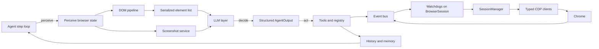

This page gives the map of `browser-use`, an open-source async Python library. It explains how one task turns into a browser loop that sees the page, decides with an LLM, acts through typed tools, and repeats until a `done` action closes the run. The official docs remain the right place for setup and how-to material; this page stays at the architecture level and points to the chapters that unpack each subsystem.

For setup and user-level examples, the official docs still own the map: [introduction](https://docs.browser-use.com/open-source/introduction), [quickstart](https://docs.browser-use.com/open-source/quickstart), [agent basics](https://docs.browser-use.com/open-source/customize/agent/basics), [browser basics](https://docs.browser-use.com/open-source/customize/browser/basics), and [supported models](https://docs.browser-use.com/open-source/supported-models).

The rest of the guide follows that chain in detail.
It links to [01 Anatomy of a Step](./01-anatomy-of-a-step.md), [02 The Event Bus and Watchdogs](./02-the-event-bus-and-watchdogs.md), [03 How the Agent Sees the Page](./03-how-the-agent-sees-the-page.md), [04 The CDP Execution Layer](./04-the-cdp-execution-layer.md), [05 The Tools and Action Registry](./05-the-tools-and-action-registry.md), [06 The LLM Layer](./06-the-llm-layer.md), [07 MCP Both Ways](./07-mcp-both-ways.md), [08 Agent Memory and State](./08-agent-memory-and-state.md), and [09 About This Site](./09-about-this-site.md).

## The entry surface

At the code level, the entry surface stays short: construct an `Agent` in `browser_use/agent/service.py` with a task and an LLM, then call `run()`.

```python
agent = Agent(task="...", llm=llm)
await agent.run()
```

`BrowserSession` stays the current browser entry point, while `Browser` remains the compatibility alias. `Tools` carries the action surface, and `Controller` remains its legacy alias for older integrations.

## The loop at map altitude

One agent step follows a fixed rhythm: `browser_use/agent/service.py` captures browser state, `browser_use/agent/message_manager/service.py` builds prompt state, the model returns `AgentOutput` with thinking and action choices, `browser_use/tools/service.py` executes those actions, and `browser_use/agent/views.py` records `ActionResult` and step history before the loop starts again. The run ends when the model emits a `done` action or the agent stops for an error, pause, or shutdown. See [Anatomy of a Step](./01-anatomy-of-a-step.md) for the full trace.

## The browser side runs on events

The browser side stays event driven. `BrowserSession` in `browser_use/browser/session.py` owns a shared `bubus.EventBus`, and `browser_use/browser/events.py` defines the typed browser events that move across it. The base helper in `browser_use/browser/watchdog_base.py` and the watchdogs in `browser_use/browser/watchdogs/default_action_watchdog.py`, `browser_use/browser/watchdogs/dom_watchdog.py`, and `browser_use/browser/watchdogs/crash_watchdog.py` attach browser side behavior to that bus instead of burying it inside the agent loop. That shape keeps navigation, health checks, DOM refresh, and action handling decoupled while still letting each browser event arrive in one place. See [The Event Bus and Watchdogs](./02-the-event-bus-and-watchdogs.md).

## The browser speaks raw CDP

`browser-use` speaks Chrome DevTools Protocol directly. The current architecture does not route through Playwright or Selenium; typed CDP clients from the first-party `cdp-use` package drive Chrome, and `SessionManager` in `browser_use/browser/session_manager.py` keeps targets and CDP sessions as the single source of truth. Attach and detach events recover from tab churn, keep per-target sessions aligned with browser reality, and let the agent survive focus changes without guessing which target still exists. See [The CDP Execution Layer](./04-the-cdp-execution-layer.md).

## Perception turns a page into prompt material

`browser_use/dom/service.py` and `browser_use/dom/views.py` turn CDP snapshots, accessibility data, and layout data into the serialized element list that the model reads. The DOM pipeline filters noise, tracks stable element identity, and pairs the result with screenshots for vision models so the agent can reason from both structure and appearance. See [How the Agent Sees the Page](./03-how-the-agent-sees-the-page.md).

## Decision and action stay separated

The action vocabulary lives in `browser_use/tools/views.py`. `browser_use/tools/registry/service.py` and `browser_use/tools/registry/views.py` register, validate, and execute those actions, while `browser_use/tools/service.py` turns model choices into browser events and `ActionResult` values. On the model side, `browser_use/llm/base.py` defines one provider-agnostic protocol, `browser_use/llm/__init__.py` keeps provider exports behind one surface, and `browser_use/llm/schema.py` keeps structured output compact and compatible with strict mode. See [The Tools and Action Registry](./05-the-tools-and-action-registry.md) and [The LLM Layer](./06-the-llm-layer.md).

## Supporting cast

`browser_use/agent/message_manager/service.py` and `browser_use/agent/message_manager/views.py` manage prompt state, history compaction, and the scratchpad filesystem backed by `browser_use/filesystem/file_system.py`, which carries context from one step to the next. `browser_use/tokens/service.py` tracks usage and cost, and `browser_use/screenshots/service.py` stores screenshots on disk for later review. `browser_use/mcp/server.py` exposes browser-use as an MCP server, while `browser_use/mcp/client.py` registers remote MCP tools as browser-use actions. See [Agent Memory and State](./08-agent-memory-and-state.md) and [MCP Both Ways](./07-mcp-both-ways.md).

## A dated scope note

As of mid-2026, the repository also carries experimental or peripheral surfaces such as `browser_use/beta/`, `browser_use/skills/`, `browser_use/sandbox/`, `browser_use/sync/`, and telemetry glue. This guide leaves those areas out of scope and focuses on the stable core. The top-level package keeps compatibility aliases too: `Browser` points to `BrowserSession`, and `Controller` points to `Tools`.

## System map



## Where to look in the code

- `browser_use/__init__.py`, `browser_use/browser/__init__.py`, and `browser_use/controller/__init__.py` — entry points and compatibility aliases.
- `browser_use/agent/service.py` — `Agent`, the main loop, and step orchestration.
- `browser_use/browser/session.py` and `browser_use/browser/session_manager.py` — `BrowserSession` and `SessionManager`.
- `browser_use/browser/events.py` and `browser_use/browser/watchdog_base.py` — browser events and watchdog attachment.
- `browser_use/dom/service.py` and `browser_use/dom/views.py` — DOM and accessibility serialization.
- `browser_use/tools/service.py`, `browser_use/tools/registry/service.py`, `browser_use/tools/registry/views.py`, `browser_use/llm/base.py`, `browser_use/llm/schema.py`, and `browser_use/agent/message_manager/service.py` — actions, model protocol, schema helpers, and prompt state.