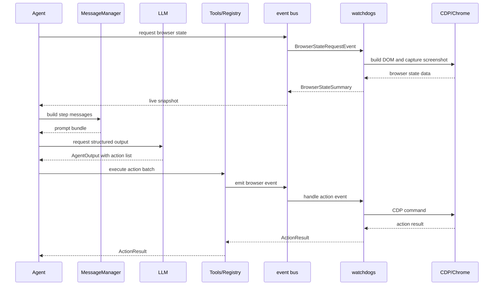

This page traces one browser-use agent step from `Agent.run()` entering the loop through browser state capture, prompt assembly, model output, action execution, and history finalization. Unlike the official configuration and how-to docs, it traces the live runtime path rather than the setup path, so it bridges the overview and the subsystem chapters.

Use it with [the event bus and watchdogs](./02-the-event-bus-and-watchdogs.md), [how the agent sees the page](./03-how-the-agent-sees-the-page.md), [the CDP execution layer](./04-the-cdp-execution-layer.md), [the tools and action registry](./05-the-tools-and-action-registry.md), [the LLM layer](./06-the-llm-layer.md), and [agent memory and state](./08-agent-memory-and-state.md) when a code path needs a deeper inspection.

## `Agent.run()` and `Agent.step()`

`Agent.run()` keeps the shared loop state alive. It preserves task state, history, plan state, message manager state, and the browser session across iterations, then calls `Agent.step()` for each pass.

`Agent.step()` rebuilds the live pieces for that pass. It captures the current browser state, builds a fresh prompt bundle, asks the model for a structured answer, executes the returned actions, and writes the results back into history before the next loop decision.

Good breakpoints sit at `Agent.step()`, `_prepare_context()`, `_get_next_action()`, `_execute_actions()`, and `_finalize()`.

## Perception begins with an event round trip

`browser_use/browser/session.py — get_browser_state_summary()` does not read the page directly. It sends `BrowserStateRequestEvent` onto the `bubus` event bus, and `browser_use/browser/watchdogs/dom_watchdog.py — DOMWatchdog.on_BrowserStateRequestEvent()` answers with a `BrowserStateSummary`.

That round trip matters because the watchdog owns the work that turns the browser into a usable snapshot. The verified DOMWatchdog behavior coordinates DOM serialization, page info, screenshot capture, request tracking, and cleanup around browser state events. The live snapshot that comes back as `BrowserStateSummary` carries the current URL, title, tabs, DOM state, screenshot, page info, and recent event context.

## Prompt assembly folds the step together

`browser_use/agent/message_manager/service.py — MessageManager.create_state_messages()` gathers the material the model needs for the next choice. It folds in the live browser snapshot, the task, history, read state, plan description, available actions, screenshots, recent events, available file paths, and unavailable skill notes.

The page specific action list comes from the registry, so this is the point where the runtime narrows the prompt to the current page. See [the tools and action registry](./05-the-tools-and-action-registry.md) for the registry side of that handoff.

## The model returns a structured batch of actions

`browser_use/agent/views.py — AgentOutput` defines the shape of the response the model must produce. The `action` field is a list for multi-action steps, so one pass can carry a batch of related actions without forcing a new model call after every click or keystroke.

The output schema and `max_actions_per_step` trimming in `browser_use/agent/service.py` limit that list before execution.

That structure keeps the decision layer provider agnostic. The agent sends the prompt bundle through the LLM layer, receives a structured `AgentOutput`, and then chooses whether to execute one action or several in the same step. See [the LLM layer](./06-the-llm-layer.md) for the model side of that boundary.

## Action execution follows the event chain

`browser_use/agent/service.py — multi_act()` hands the batch to `browser_use/tools/service.py — Tools.act()`, which passes the work to `browser_use/tools/registry/service.py — Registry.execute_action()`. The registry turns each model action into a browser event, and `browser_use/browser/watchdogs/default_action_watchdog.py — DefaultActionWatchdog` handles most element actions, with navigation and tab events handled directly by `BrowserSession`.

The batch can stop early when an action says the sequence should end, when an action fails, or when the browser changes page or focus target. That early exit keeps the next model call aligned with the new browser state instead of asking the agent to continue from a stale snapshot.

## Results flow back into memory and history

Each handler returns an `ActionResult` with `extracted_content`, `long_term_memory`, `include_extracted_content_only_once`, `error`, `is_done`, `success`, `attachments`, `images`, and `metadata`. That result feeds the next prompt through `MessageManager.create_state_messages()`, and it also lands in the step history so the agent can carry the outcome forward.

`browser_use/browser/views.py — BrowserStateHistory` stores the past browser snapshot, while `browser_use/agent/views.py — AgentHistoryList` stores the full step trace. `AgentHistoryList.is_done()` decides whether the run ends on a `done` result, and `AgentHistoryList.final_result()` exposes the terminal content when the run finishes. When `multi_act()` stops early because the page changes or an error appears, `AgentHistoryList` keeps the results already collected in history and skips the remaining actions in the batch.

## Mermaid sequence diagram

## One step at a glance

1. `browser_use/agent/service.py — Agent.run()`
2. `browser_use/agent/service.py — Agent.step()`
3. `browser_use/browser/session.py — get_browser_state_summary()`
4. `browser_use/browser/events.py — BrowserStateRequestEvent`
5. `browser_use/browser/watchdogs/dom_watchdog.py — DOMWatchdog.on_BrowserStateRequestEvent()`
6. `browser_use/agent/message_manager/service.py — MessageManager.create_state_messages()`
7. `browser_use/agent/service.py — _get_next_action()`
8. `browser_use/agent/service.py — multi_act() -> browser_use/tools/service.py — Tools.act() -> browser_use/tools/registry/service.py — Registry.execute_action()`
9. `browser_use/agent/views.py — ActionResult -> browser_use/agent/views.py — AgentHistoryList`
10. `browser_use/agent/service.py — Agent.run() loop decision`

## Where to look in the code

- `browser_use/agent/service.py` — `Agent.run()`, `Agent.step()`, `_prepare_context()`, `_get_next_action()`, `_execute_actions()`, `_finalize()`
- `browser_use/browser/session.py` — `get_browser_state_summary()`, event bus dispatch, watchdog attachment
- `browser_use/browser/watchdogs/dom_watchdog.py` — `DOMWatchdog.on_BrowserStateRequestEvent()`, DOM and screenshot capture
- `browser_use/agent/message_manager/service.py` — `MessageManager.create_state_messages()`, step prompt assembly
- `browser_use/agent/views.py` — `AgentOutput`, `ActionResult`, `AgentHistoryList`; `browser_use/browser/views.py` — `BrowserStateHistory`
- `browser_use/tools/service.py` and `browser_use/tools/registry/service.py` — `Tools.act()` and `Registry.execute_action()`