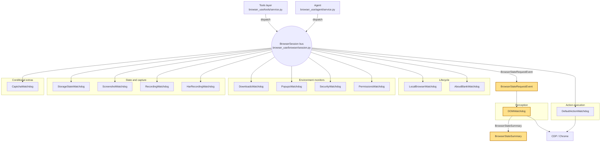

## Overview

`BrowserSession` in `browser_use/browser/session.py` does not call browser helpers directly. It dispatches typed events onto a bus, watchdogs subscribe to the event types they understand, perform the work over CDP or local browser state, and return typed results that the caller awaits. That model keeps browser responsibilities split apart, applies event-specific timeouts from `browser_use/browser/events.py`, and gives the session one recovery path when the browser connection drops.

The bus also keeps event history and parent IDs. That lineage turns a browser interaction into a tree of cause and effect instead of a flat log stream.

## The bus itself

The browser layer uses `bubus.EventBus` as its event engine. `BrowserSession` wraps that bus with `ResilientEventBus` in `browser_use/browser/session.py` so shutdown and reconnect paths can keep stepping the bus without falling over a torn-down instance. `dispatch()` returns an awaitable event object, so the caller waits for the handlers to finish and then reads the typed result from `event.event_result()`.

Two buses live in the repository, and they solve different problems. `browser_use/agent/service.py` owns a separate bus for agent lifecycle, step, and cloud-sync events. `BrowserSession` owns the browser bus for page work, tab work, and CDP work. Keeping those buses separate keeps browser interaction out of the agent control plane.

`browser_use/browser/events.py` defines the browser events as typed `BaseEvent[...]` models. Each event carries typed fields, and many events also expose an `event_timeout` that reads a `TIMEOUT_*Event` environment variable through `_get_timeout()`.

## The watchdog contract

`browser_use/browser/watchdog_base.py` defines the contract for every watchdog. Each watchdog declares `LISTENS_TO` and `EMITS`, then implements handlers named `on_<EventName>`. `BaseWatchdog.attach_to_session()` scans those methods, matches them against the event classes in `browser_use/browser/events.py`, and registers them on the browser bus. `BrowserSession.attach_all_watchdogs()` in `browser_use/browser/session.py` uses that contract to wire in the full fleet.

The wrapper around each handler acts like a circuit breaker. It skips non lifecycle events while `browser_session.is_cdp_connected` is false, waits for `browser_session._reconnect_event` when `browser_session.is_reconnecting` is true, and retries session recovery through `get_or_create_cdp_session()` when a handler fails but the browser still looks recoverable. Lifecycle events such as `BrowserStartEvent`, `BrowserStopEvent`, `BrowserStoppedEvent`, `BrowserLaunchEvent`, `BrowserKillEvent`, `BrowserReconnectingEvent`, `BrowserReconnectedEvent`, and `BrowserErrorEvent` still run during disconnects.

The same wrapper also walks `event_bus.event_history` to print parent and grandparent lineage. That gives each handler a short history of what triggered it, which matters when one event dispatches another event from inside a handler.

## The watchdog fleet

`browser_use/browser/session.py` attaches the fleet so the session stays thin. Each watchdog owns one concern and stays out of the others.

### Perception

`browser_use/browser/watchdogs/dom_watchdog.py` acts as the perception hub. It listens for `BrowserStateRequestEvent`, builds `BrowserStateSummary`, coordinates screenshot capture by dispatching `ScreenshotEvent`, and keeps the cached DOM state and selector map ready for the rest of the browser layer. That path is the core of [How the Agent Sees the Page](./03-how-the-agent-sees-the-page.md).

### Action execution

`browser_use/browser/watchdogs/default_action_watchdog.py` handles the main browser actions: click, type, scroll, upload, and related navigation work. It receives resolved `EnhancedDOMTreeNode` values from `browser_use/browser/events.py`, turns them into CDP calls, and keeps downloads, focus changes, and field behavior separate from the session object. That path underpins [The CDP Execution Layer](./04-the-cdp-execution-layer.md).

### Browser lifecycle

`browser_use/browser/watchdogs/local_browser_watchdog.py` launches and kills the local browser subprocess. `browser_use/browser/watchdogs/aboutblank_watchdog.py` keeps `about:blank` tabs alive and gives the browser a visible waiting state. `browser_use/browser/watchdogs/crash_watchdog.py` is currently commented out in `browser_use/browser/session.py`, so it is inactive. This separation keeps start, stop, and recovery code out of the main session body.

### Environment monitors

`browser_use/browser/watchdogs/downloads_watchdog.py` handles safe downloads and emits `FileDownloadedEvent`. `browser_use/browser/watchdogs/popups_watchdog.py` handles JavaScript dialogs and records their messages. `browser_use/browser/watchdogs/security_watchdog.py` enforces allowed and prohibited domains, then blocks or redirects blocked navigation. `browser_use/browser/watchdogs/permissions_watchdog.py` grants configured permissions as soon as the browser connects. Each watchdog guards one boundary, so one boundary can fail without masking the others.

### State and capture

`browser_use/browser/watchdogs/storage_state_watchdog.py` keeps cookies and storage state on disk and loads them again on connect. `browser_use/browser/watchdogs/screenshot_watchdog.py` captures screenshot data for `ScreenshotEvent`. `browser_use/browser/watchdogs/recording_watchdog.py` records video, and `browser_use/browser/watchdogs/har_recording_watchdog.py` writes network activity to HAR. Each file owns a different kind of evidence: auth state, pixels, video, or network history.

### Conditional extras

`browser_use/browser/watchdogs/captcha_watchdog.py` watches the proxy captcha solver events and exposes `wait_if_captcha_solving()`. That watchdog stays optional because only some deployments surface captcha signals, but the event path still fits the same bus model.

This split keeps the session object small and keeps the browser layer from turning into a single large handler.

## The event vocabulary

`browser_use/browser/events.py` defines the vocabulary that all browser work uses. The file models actions and lifecycle changes as typed `BaseEvent` classes, and `ElementSelectedEvent` gives element-targeted actions a resolved `EnhancedDOMTreeNode` instead of a raw selector index. That design lets handlers work on the actual node that the DOM service resolved.

Representative element-targeted events include `ClickElementEvent`, `TypeTextEvent`, `ScrollEvent`, `UploadFileEvent`, `GetDropdownOptionsEvent`, and `SelectDropdownOptionEvent`. Representative lifecycle events include `BrowserStartEvent`, `BrowserStopEvent`, `BrowserConnectedEvent`, `BrowserStoppedEvent`, `BrowserLaunchEvent`, `BrowserKillEvent`, `TabCreatedEvent`, `TabClosedEvent`, `NavigationStartedEvent`, `NavigationCompleteEvent`, and `AgentFocusChangedEvent`. The set stays broad enough for the browser layer, but it still keeps each event narrow and typed.

Watchdogs can dispatch more events from inside a handler, so cascades stay in the same lineage tree. `SecurityWatchdog` emits `BrowserErrorEvent` when it blocks navigation. `StorageStateWatchdog` dispatches load and save events around browser connect and stop. `PopupsWatchdog` records dialog handling, and `CaptchaWatchdog` turns proxy events into browser events. Parent lineage keeps those cascades readable.

## Upward flow from Tools and Agent

The `Tools` class in `browser_use/tools/service.py` turns agent actions into browser events. The sibling page [The Tools layer](./05-the-tools-and-action-registry.md) covers the same dispatch path. It dispatches events such as `NavigateToUrlEvent`, `ClickElementEvent`, `ClickCoordinateEvent`, `TypeTextEvent`, `ScrollEvent`, `UploadFileEvent`, `SwitchTabEvent`, and `CloseTabEvent`, then waits for each result before continuing. That keeps the action layer thin and keeps browser details inside the browser bus.

The agent uses the same round-trip for perception. [Anatomy of a Step](./01-anatomy-of-a-step.md) covers the perception round-trip: `BrowserSession.get_browser_state_summary()` dispatches `BrowserStateRequestEvent`, `DOMWatchdog` assembles the page state, and the caller receives `BrowserStateSummary`. The agent bus in `browser_use/agent/service.py` stays separate so agent lifecycle and cloud-sync events do not mix with browser interaction.

The tradeoff is indirection. Control flow moves into the bus, so reading the code requires following event names instead of a direct call stack. Timeout tuning also needs care: `browser_use/browser/events.py` and `browser_use/browser/watchdogs/captcha_watchdog.py` read `TIMEOUT_*Event` environment variables, which lets the system stretch or shrink one event without changing the others. The public timeout reference at [all parameters](https://docs.browser-use.com/open-source/customize/agent/all-parameters) documents those variables.

## Where to look in the code

- `browser_use/browser/session.py` — `BrowserSession`, `ResilientEventBus`, watchdog attachment, and CDP reconnect flow.
- `browser_use/browser/watchdog_base.py` — watchdog registration, reconnect guard, and lineage logging.
- `browser_use/browser/events.py` — typed browser events, `ElementSelectedEvent`, and timeout defaults.
- `browser_use/browser/watchdogs/dom_watchdog.py` — browser state assembly and screenshot coordination.
- `browser_use/browser/watchdogs/default_action_watchdog.py` — CDP execution for click, type, scroll, upload, and related actions.
- `browser_use/tools/service.py` — the `Tools` dispatcher that sends browser events and waits for their results.