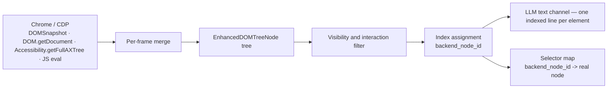

A live browser page is too large, too noisy, and too volatile for a model to reason over directly, so browser-use compresses it into a browser state summary. That summary gives the agent a compact action surface without forcing it to carry the whole rendered document in memory.

The text channel presents a serialized list of visible and interactive elements, while the screenshot channel covers the visual details that the text summary leaves out. Together they give the agent a compact action surface and a picture of the page that stays close to what a human would notice.

## Perception in the event loop

The perception path starts when `BrowserStateRequestEvent` reaches `DOMWatchdog`, which gathers the state the agent needs before the next action. The broader event flow and step timing live in [Anatomy of a step](./01-anatomy-of-a-step.md) and [The event bus and watchdogs](./02-the-event-bus-and-watchdogs.md); this page focuses on what `DOMWatchdog` assembles once that request arrives.

`DOMWatchdog` coordinates the browser state round trip. It builds the DOM view, reuses cached browser state when it can, captures a clean screenshot, gathers page metadata, and then returns a `BrowserStateSummary` that combines those pieces into one payload for the agent.

## The enhanced DOM tree

The DOM pipeline in `browser_use/dom/service.py` starts by pulling the snapshot, DOM and accessibility trees in parallel, plus small JavaScript probes for iframe scroll state and click-listener detection. That gives the system three different angles on the same page: structure, accessibility, and rendered geometry.

The service then merges those inputs into one `EnhancedDOMTreeNode` tree. It stitches iframe content into the same tree, discovers cross-origin out-of-process frames through their own CDP targets, and only fetches cross-origin content when the tree actually needs it. On heavy pages, it also skips the listener sweep once the page exceeds 10,000 elements, because that pass costs too much for very large documents.

## From tree to action surface

`browser_use/dom/serializer/serializer.py` and `browser_use/dom/views.py` turn the enhanced tree into the shape the model reasons over. The serializer keeps the tree small by showing only elements that matter for action, but it makes deliberate exceptions for scrollable containers, dropdowns, shadow DOM content, and file inputs so the agent still sees the controls that would otherwise disappear.

That makes the text channel closer to an action surface than a raw DOM dump: it keeps what the agent can use, not every node the browser exposes.

The bracketed index in the text output is the element’s CDP `backend_node_id`, not a simple 1..N counter. That detail matters because the selector map uses the same backend node ID as the stable handle, the action layer resolves that handle back to a real node and then to coordinates through CDP, and unchanged elements keep the same handle across steps until the page changes.

## Change tracking and cache reuse

The serializer compares the current selector map with the one from the previous step and marks elements that were not present before. That gives the model a quick cue about what changed since its last action without forcing it to re-scan the whole page.

Cache reuse follows the same pattern. `DOMWatchdog` rebuilds from `previous_cached_state` when it has one, `BrowserSession` clears cached browser state and selector maps when navigation occurs, focus changes, or the session resets, and scroll changes also invalidate the selector map because that map only covers visible elements. The cache helps when the page stays stable, but it never outlives a change that makes the current view unreliable.

## The visual channel

`ScreenshotWatchdog` removes highlights before `Page.captureScreenshot` runs, so the image the model receives stays clean and free of overlay noise. That keeps the screenshot useful as a visual companion to the text summary instead of turning it into a copy of the annotations.

`browser_use/browser/python_highlights.py` adds the overlay after capture, using the same `backend_node_id` values that the text summary shows and the same selector map that the serializer produced. The overlay and the text channel stay in lockstep because they point at the same handles.

## Other reading modes

`browser_use/dom/markdown_extractor.py` follows a different path: it extracts the page’s content into markdown for reading, not the interactive-element list used for action. `browser_use/dom/serializer/html_serializer.py` feeds that path by rebuilding HTML from the enhanced tree before markdown conversion.

`SerializedDOMState.eval_representation()` routes through `browser_use/dom/serializer/eval_serializer.py`, which favors a fuller structural view for evaluation and judge contexts. That rendering keeps more of the page shape and fewer action cues, because those contexts need comprehension rather than click targeting.

Both paths still depend on the same enhanced tree, but they optimize for understanding instead of control.

## The trade-off

This representation gives up layout fidelity, styling detail, and most non-useful text nodes. That loss is deliberate: an acting agent needs a compact accessibility tree plus interactivity view, and the screenshot channel carries the visual remainder.

The screenshot fills the missing visual context without forcing the text channel to carry page geometry or decorative detail.

## Where to look in the code

- `browser_use/browser/watchdogs/dom_watchdog.py` — browser state assembly, cache reuse, and scroll invalidation.
- `browser_use/dom/service.py` — CDP capture, iframe stitching, listener detection, and cross-origin frame fetches.
- `browser_use/dom/serializer/serializer.py` — filtering, index assignment, selector-map creation, and new-element marking.
- `browser_use/browser/watchdogs/screenshot_watchdog.py` — clean screenshot capture without overlays.
- `browser_use/browser/python_highlights.py` — post-capture highlight rendering from the selector map.
- `browser_use/browser/watchdogs/default_action_watchdog.py` — resolves backend node handles back to CDP clicks, typing, and scrolls.