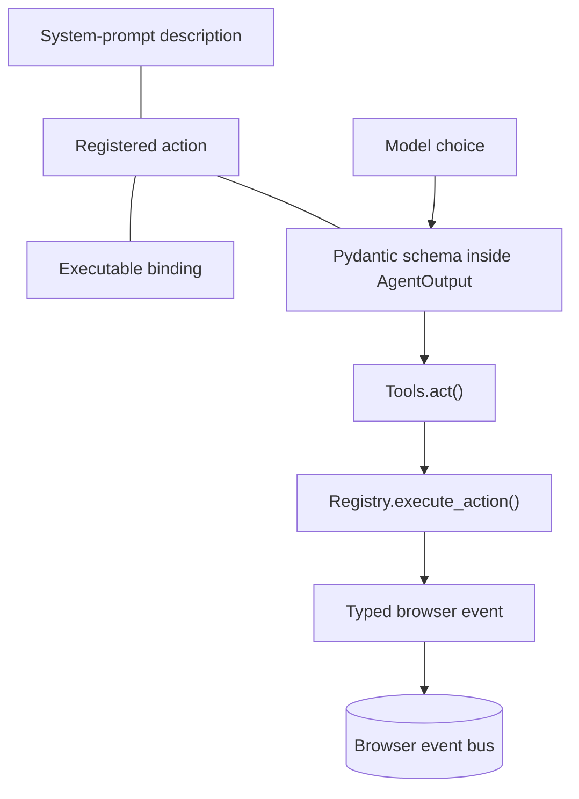

This page explains the tools and action registry as the mental model behind browser-use action selection. It keeps the execution path understandable without chasing through the codebase, while still showing why one registry owns action registration, schema generation, and execution. The page reads as a field guide: enough depth to explain the design, not a line-by-line reference.

For procedural usage, the official guide remains the source of record: [basics](https://docs.browser-use.com/open-source/customize/tools/basics), [add](https://docs.browser-use.com/open-source/customize/tools/add), [available](https://docs.browser-use.com/open-source/customize/tools/available), and [response](https://docs.browser-use.com/open-source/customize/tools/response). This page stays at the design level so the registry reads as a single contract rather than a pile of helpers.

## Mental model

Browser-use projects one registered action three ways: prompt text, a Pydantic schema, and executable behavior. One registration point keeps those three projections in sync, so the agent sees the same capability in the prompt, in validation, and at runtime. The registry owns that contract instead of letting the model invent a tool shape on its own. Because the same registration feeds all three views, a new action needs only one source of truth and the surrounding system stays aligned as the code evolves.

That split matters because the model does not talk directly to the browser. `AgentOutput.action` carries a list of `ActionModel` instances, and each instance must match the registry-generated schema before `Tools.act()` runs it. The registry and agent model therefore catch invalid choices before any browser side effect starts, which keeps errors close to the action that caused them. That also keeps the browser layer free from schema drift, because the same registry data drives both selection and execution.

## Built-in vocabulary

The built-in vocabulary clusters around navigation, element interaction, reading, task control, and file system work. Navigation covers go to URL, back, wait, and tab management such as switching or closing tabs. Element interaction covers clicking, typing, scrolling, keyboard shortcuts, uploads, and dropdown choice. Reading covers page search, DOM queries, extraction, screenshots, and PDF capture. Task control centers on `done`, which closes the run and carries the final result. File system actions sit beside that vocabulary because they preserve state and hand artifacts to later steps; see `./08-agent-memory-and-state.md`.

The action set stays small on purpose. An experienced operator does not need a catalog of every built-in function on this page; the mental model matters more than the inventory. The individual usage pages carry the procedural details, and the registry keeps the built-ins grouped so the prompt stays readable. Tab management lives with navigation because it changes which page the agent can see and act on next.

## Execution path

At runtime, the model chooses from the schema, `Tools.act()` walks the selected action list, and `Registry.execute_action()` validates parameters before calling the registered function. The wrapper stays thin on purpose: it normalizes the model's choice, then hands control to the browser layer instead of trying to manage page state itself. The browser session owns the real event handling, tab focus, and side effects on the event bus, so the action layer stays focused on selection rather than browser bookkeeping.

A click illustrates the pattern. The registry resolves the element index through the session selector map, the wrapper builds `ClickElementEvent(node=...)`, and the browser layer handles that event on the bus before the action returns an `ActionResult`. That path makes the event bus and CDP layer the real execution surface, not the language model itself, and it keeps the browser work typed from end to end. The browser layer can then switch tabs, navigate, or emit follow-up events without asking the registry to understand those mechanics. See `./02-the-event-bus-and-watchdogs.md` and `./04-the-cdp-execution-layer.md`.

## ActionResult feedback

Every action returns an `ActionResult`, even when it only updates state for the next step. `extracted_content` feeds the next prompt, `long_term_memory` persists across steps, and `include_extracted_content_only_once` moves large content into the read-state path so the prompt stays bounded. `error`, `attachments`, and `metadata` carry failure details and side channels; `is_done` and `success` let `done` end the run with a clear completion signal. In practice, that makes the result a control signal as much as a summary: the next step can continue, adjust course, or stop cleanly.

That return value also steers the next turn. The message manager takes those fields, reshapes them into the next user message, and decides whether the content should live in the short prompt, the read state, or long-term memory. That keeps the agent from carrying forward raw history when a tighter summary will do. See `./01-anatomy-of-a-step.md`.

## Context-sensitive action sets

The registry also narrows the vocabulary to the current page. A call to `Registry.get_prompt_description()` keeps the unfiltered actions in the system prompt, and a separate call to `Registry.get_prompt_description(page_url)` adds only the page specific actions that match the current URL or domain filters. The agent rebuilds that set every step, which keeps the prompt aligned with the page currently in front of the browser and avoids advertising actions that would fail on the current site. That matters most on pages whose controls change with login state, tab focus, or nested content.

A smaller page appropriate action set reduces invalid calls and gives the model less room to choose irrelevant tools. That reliability gain matters more than perfect recall of every possible action, and it also reduces the chance that the model reaches for a tool the page cannot use right now.

## Extensibility and legacy names

Custom actions that use the same decorator enter the same pipeline. They appear in prompt text, receive a generated schema, and execute through the same registry path as built-ins, so custom behavior and built-in behavior share one vocabulary. MCP toolsets fit the same mental model from the outside, though they travel through the bridge described in `./07-mcp-both-ways.md`. Custom actions therefore inherit the same filtering and result handling as built-ins, which keeps mixed toolsets predictable.

Note: `Controller` remains the legacy alias of `Tools` for older integrations.

## Registry diagram

## Where to look in the code

- `browser_use/tools/registry/service.py` — signature normalization, URL filtering, schema validation, and action dispatch.
- `browser_use/tools/registry/views.py` — registered action model, prompt description rendering, and special injected parameters.
- `browser_use/tools/service.py` — built-in registrations, `Tools.act()`, click flow, structured output hook, and the `Controller` alias.
- `browser_use/agent/service.py` — rebuilds the action model each step and injects page-specific action text.
- `browser_use/agent/views.py` — `AgentOutput` and `ActionResult`.
- `browser_use/browser/events.py` and `browser_use/browser/session.py` — typed browser events, selector maps, and DOM resolution.