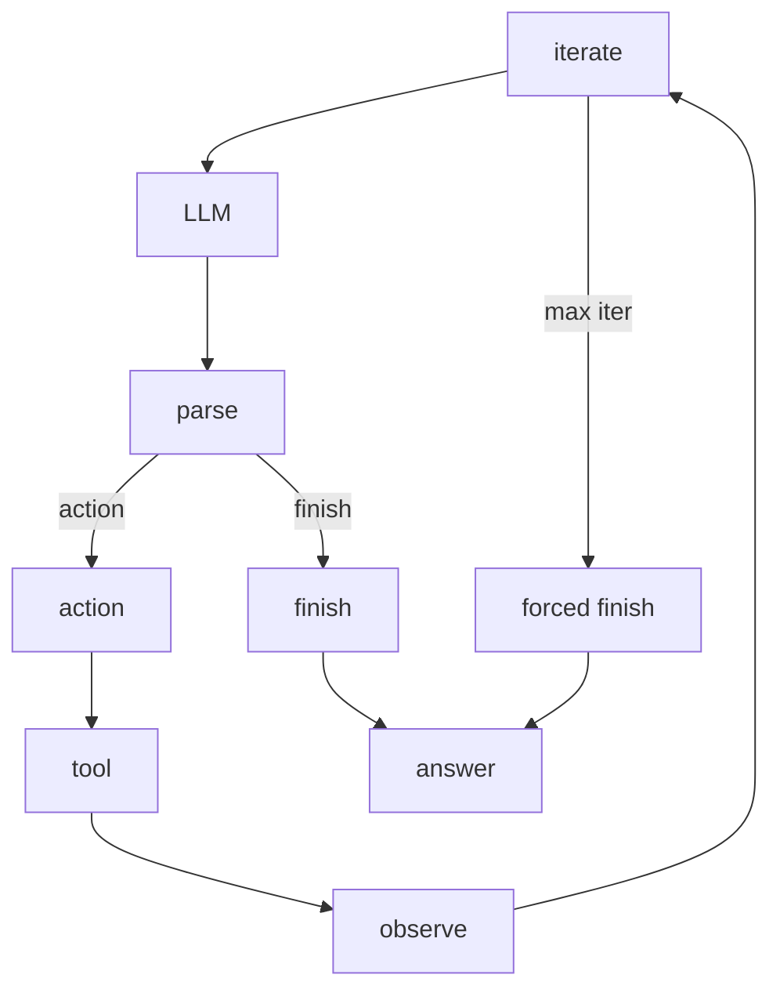

`CrewAgentExecutor` drives the inner loop of one agent turn. `Task` owns the outer lifecycle, `Agent` prepares the prompt and executor, and this page explains what happens after control enters the turn boundary. The class still names the legacy executor path, while `Agent` now defaults to `AgentExecutor`.

## Two execution styles

The executor follows two runtime styles: the ReAct text loop and the native tool calling loop. It picks the native path only when the LLM reports native function calling support and the agent has tools to use; otherwise it stays in text mode. If the native path hits an unsupported provider error, the executor adds text tool instructions and falls back to the ReAct loop.

## The ReAct loop as a sequence of stations

The text loop moves through a fixed order.

1. The executor checks `iterations` against `max_iter`.
2. When the limit is reached, `handle_max_iterations_exceeded` asks the LLM for one more pass and turns that reply into the final answer instead of failing the run.
3. `enforce_rpm_limit` pauses for the request cap.
4. The executor calls the LLM through the shared LLM wrapper.
5. The parser turns the response into `AgentAction` or `AgentFinish`.
6. An `AgentAction` flows into tool execution, and the executor appends the observation to message history.
7. The loop increments the counter and starts the next pass.

`ToolUsage` sits beneath this loop and selects the closest tool name, parses and validates arguments, and handles caching, telemetry, and tool errors. It can also end the turn when a tool marks `result_as_answer`.

## Recovery and retries

`handle_context_length` compacts and summarizes messages when `respect_context_window` is true, then retries; when that flag is false, the run stops with a `SystemExit` failure. `handle_output_parser_exception` reinjects the parser guidance as a user message, so the loop either repairs the conversation or surfaces the runtime failure.

## Native tool calling

The native path handles structured tool calls instead of ReAct text, and `_handle_native_tool_calls` normalizes provider-specific shapes into one internal form, maps each call back to the original tool, and sends safe batches through a `ThreadPoolExecutor` when the batch can run together. The executor keeps calls sequential when any tool in the batch can end the turn with `result_as_answer` or carries a usage cap, and it still honors the same exit rules as the text loop while appending the assistant tool-call message and the tool result message back into history before adding a short reasoning prompt.

## Async and human feedback

The async path mirrors the sync path one-for-one. `ainvoke`, `_ainvoke_loop`, `_ainvoke_loop_react`, and `_ainvoke_loop_native_tools` follow the same branch points, but they call the async LLM and tool helpers instead of the sync ones. Async kickoffs and Flows use this path.

Human feedback stays inside the same executor rather than opening a separate branch: `_handle_human_feedback` and `_ahandle_human_feedback` hand the final answer to the provider in `human_input.py`, and the provider can prompt for another pass until the reviewer submits a blank response. In training mode, the provider records the initial answer, the feedback note, and the improved answer as one feedback pass.

Adjacent pages cover the outer kickoff envelope, the context rules around retries, the async barrier, and the LLM layer: [/01-anatomy-of-a-kickoff.md](./01-anatomy-of-a-kickoff.md), [/03-context-guardrails-and-retries.md](./03-context-guardrails-and-retries.md), [/05-threads-asyncio-and-the-async-barrier.md](./05-threads-asyncio-and-the-async-barrier.md), and [/08-the-llm-layer.md](./08-the-llm-layer.md).

## Where to look in the code

- `lib/crewai/src/crewai/agents/crew_agent_executor.py`: the turn loop, branch selection, retries, tool execution, and feedback handoff.
- `lib/crewai/src/crewai/utilities/agent_utils.py`: LLM wrappers, parser error reinjection, context recovery, iteration forcing, and native tool helpers.
- `lib/crewai/src/crewai/tools/tool_usage.py`: tool lookup, argument repair, cache checks, usage limits, and usage events.
- `lib/crewai/src/crewai/core/providers/human_input.py`: human review prompts and repeated feedback passes.
- `lib/crewai/src/crewai/task.py`: the outer task lifecycle and the step hook boundary around agent execution.
- `lib/crewai/src/crewai/llm.py` and `lib/crewai/src/crewai/agents/parser.py`: provider capability checks and ReAct parsing into `AgentAction` and `AgentFinish`.