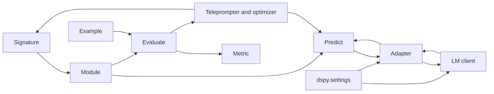

DSPy treats program design as a chain of small concepts rather than a monolith. This page is the hub for the rest of the 10-page field guide. Start with [01-anatomy-of-a-call.md](./01-anatomy-of-a-call.md), then follow [02-the-lm-layer.md](./02-the-lm-layer.md) and [03-caching.md](./03-caching.md) for runtime behavior, [04-what-compile-does.md](./04-what-compile-does.md), [05-inside-miprov2.md](./05-inside-miprov2.md), and [06-the-proposer.md](./06-the-proposer.md) for compilation, and finish with [07-streaming.md](./07-streaming.md), [08-production.md](./08-production.md), and [09-about-this-site.md](./09-about-this-site.md) for the runtime edges and the site itself. A `Signature` declares the task, a `Module` composes `Predict` objects into a program, adapters turn that program into provider messages and typed results, the LM client transports the call, `Evaluate` scores the result on `Example`s, and teleprompters search for better prompt state. The [official DSPy docs](https://dspy.ai/) cover the deeper API surface for signatures, modules, adapters, and settings that this hub leaves out.

## Signature

A `Signature` is a Pydantic-based contract. The class itself is the object DSPy passes around, and its docstring carries the instructions that tell the LM what to do. The fields stay declarative: typed inputs on one side, typed outputs on the other. That keeps the task definition small enough for adapters, predictors, and optimizers to share without translation logic in the program body. The [official DSPy docs](https://dspy.ai/) cover the full signature API; for the call path that consumes it, see [01-anatomy-of-a-call.md](./01-anatomy-of-a-call.md).

## Module and Predict

A `Module` turns a task contract into executable control flow. `Predict` sits inside that tree as both a `Module` and a `Parameter`, which means a program can nest predictors and still expose them to walks over named parameters and submodules. That structure matters because a teleprompter can inspect the tree, update optimizer-visible state such as demos or instructions, and leave the program's branching alone. The [official DSPy docs](https://dspy.ai/) cover the full module API; for the call path that runs inside the tree, see [01-anatomy-of-a-call.md](./01-anatomy-of-a-call.md), [02-the-lm-layer.md](./02-the-lm-layer.md), and [03-caching.md](./03-caching.md).

## Adapters

An `Adapter` owns the boundary between DSPy objects and provider calls. It reads the `Signature`, demos, and current inputs, renders provider messages, chooses native provider features when they help, and parses the response back into the signature's typed shape. That centralization keeps type coercion and provider quirks in one place instead of spreading them through every program. For the call path that feeds it, see [01-anatomy-of-a-call.md](./01-anatomy-of-a-call.md), [02-the-lm-layer.md](./02-the-lm-layer.md), and [03-caching.md](./03-caching.md); the [official DSPy docs](https://dspy.ai/) cover the lower-level adapter API.

## LM client and settings

The LM client moves the request over the wire and returns the provider response. `dspy.settings` supplies the global runtime state that every program reads, while `dspy.configure` and `dspy.context` set the long-lived defaults or the temporary overrides that a call sees. The [official DSPy docs](https://dspy.ai/) cover the configuration model in more detail. For the runtime flow that depends on these settings, see [02-the-lm-layer.md](./02-the-lm-layer.md), [03-caching.md](./03-caching.md), [07-streaming.md](./07-streaming.md), and [08-production.md](./08-production.md).

## Evaluate

`Evaluate` runs a `Module` across a set of `Example`s, compares each `Prediction` with a metric, and returns a score plus per-example results. `dspy/evaluate/metrics.py` keeps the scoring helpers close to the evaluation loop, and `dspy/evaluate/auto_evaluation.py` shows that LLM judge metrics still fit the same module model. That makes evaluation more than a report: it becomes the feedback signal that teleprompters search against. For the compile loop that consumes that signal, see [04-what-compile-does.md](./04-what-compile-does.md), [05-inside-miprov2.md](./05-inside-miprov2.md), and [06-the-proposer.md](./06-the-proposer.md).

## Teleprompters and optimizers

Teleprompters compile a program instead of rewriting its control flow. They tune the optimizer-visible state inside `Predict`, especially demos, signature instructions, and related prompt parameters, then keep the version that scores best under evaluation. The compile story continues in [04-what-compile-does.md](./04-what-compile-does.md), [05-inside-miprov2.md](./05-inside-miprov2.md), and [06-the-proposer.md](./06-the-proposer.md); the code in `dspy/teleprompt/teleprompt.py`, `dspy/teleprompt/bootstrap.py`, `dspy/teleprompt/mipro_optimizer_v2.py`, `dspy/teleprompt/utils.py`, and `dspy/propose/grounded_proposer.py` shows how the loop builds and scores candidate programs. The final pages of the guide, [07-streaming.md](./07-streaming.md), [08-production.md](./08-production.md), and [09-about-this-site.md](./09-about-this-site.md), cover the runtime edges and the guide itself.

In DSPy, you program the task and compile the prompting.

## Where to look in the code

- `dspy/signatures/signature.py` defines declarative task contracts and field metadata.
- `dspy/primitives/module.py` and `dspy/predict/predict.py` define composition, tree walks, and optimizer-visible predictors.
- `dspy/adapters/base.py` owns rendering, parsing, and type coercion.
- `dspy/dsp/utils/settings.py` and `dspy/evaluate/evaluate.py` define runtime state and scoring.
- `dspy/teleprompt/mipro_optimizer_v2.py` shows compilation and search over prompt state.