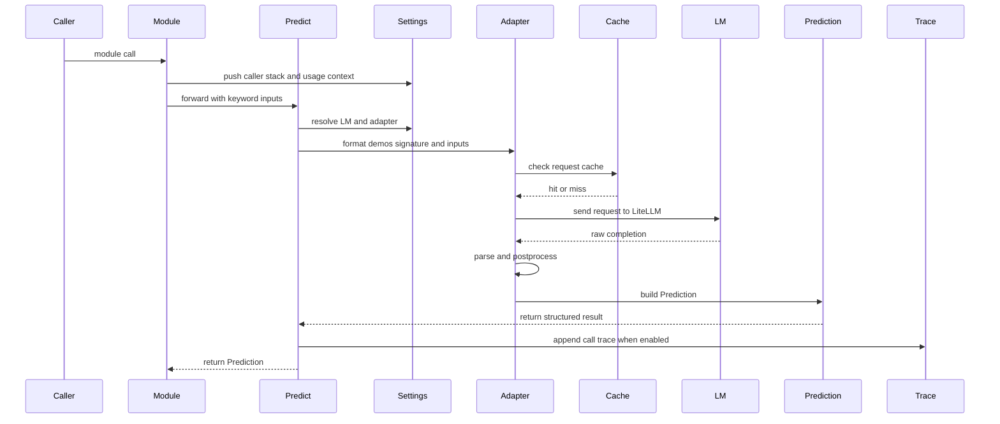

This page follows one DSPy call from `dspy.Predict("question -> answer")` through the runtime layers that turn it into a structured `Prediction`. It shows how the call moves, why each layer exists, and where to look when a result or trace does not match the expected shape.

`ChainOfThought` takes the same path. It only adds a `reasoning` field before the call continues through the same module, adapter, LM, and trace machinery.

## Module.__call__ to `Predict.forward()`

`Module.__call__` starts the runtime story. It wraps `forward()`, pushes the current module onto `settings.caller_modules`, and opens usage tracking when the configuration asks for it. That wrapper matters because DSPy treats the module call as the unit that owns history, callbacks, and trace lineage. A direct `forward()` call skips that infrastructure, so DSPy warns when code bypasses the wrapper.

`Predict` adds one more layer of intent. It turns the generic module wrapper into the concrete prediction path that most programs use, so the same call surface can carry signatures, demos, and model settings without forcing the caller to wire each step by hand.

## Settings and adapter resolution

`Predict.forward()` reads the active LM from the call, then from `self.lm`, then from `settings.lm`. It reads the adapter from `settings.adapter` and falls back to `ChatAdapter()` when nothing overrides it. That order keeps the call tree predictable: local overrides win for one block, object state wins next, and process defaults fill the gap.

`settings.context(...)` makes that behavior work cleanly; see [Settings and context()](https://dspy.ai/diving-deeper/settings-and-context/) for the full story. It shadows the global settings for one call tree, so a temporary LM swap or adapter swap reaches every nested module without rebuilding the program. That seam lets one program switch models or formatting rules inside a block.

## Adapter formatting

The adapter turns the signature, demos, and current inputs into the prompt shape that the LM can read. `Adapter.__call__` runs a fixed lifecycle: preprocess, format, LM call, postprocess, and parse. That sequence keeps the call contract stable even when the prompt format changes.

`ChatAdapter` uses the marker format with `[[ ## field ## ]]` sections. It renders the field structure, includes the task instructions, and then parses the answer by splitting the completion back into named fields. `parse_value` converts each field into the declared type, so the adapter owns both prompt shape and type recovery. When marker parsing fails, `ChatAdapter` can fall back to `JSONAdapter` unless the LM error itself should surface. That fallback gives the default adapter a wider operating range without making the happy path more complex.

## LM dispatch and caching

The adapter hands the normalized request to `BaseLM`. `LM.forward()` and `LM.aforward()` send that request to LiteLLM. The cache check sits in front of provider work, so a hit can return immediately without spending tokens or time on a remote call. The cache boundary also keeps request normalization in one place, which makes the rest of the stack treat cached and uncached calls the same way.

When the response misses cache, DSPy records usage and history. On the legacy path, `BaseLM` stores the provider response shape and the derived outputs. On the normalized path, `BaseLM._finalize_lm_response()` records a typed `LMHistoryEntry`, which gives later tooling a structured record of the request and response. That split keeps legacy behavior in place while the LM layer moves toward the newer typed boundary.

## Parse, postprocess, and `Prediction`

After the LM returns, the adapter parses the completion into field values and then `Predict._forward_postprocess()` turns those values into a `Prediction` with `Prediction.from_completions()`. The `Prediction` keeps the parsed fields and the underlying `Completions` object, so later code can inspect both the final answer and the completions that produced it. `Prediction` also carries LM usage, which lets higher-level code tie the answer back to token cost.

`AdapterParseError` marks a contract failure between the prompt and the LM output. It does not mean the model failed to answer; it means the output did not match the field structure the adapter asked for. That distinction matters because bootstrapping and optimization code can catch the error, keep the completion text, and score the result instead of losing the call entirely.

## Trace capture

`Predict._forward_postprocess()` appends `(module, inputs, prediction)` to `settings.trace` when tracing stays enabled. That keeps trace capture inside the call tree instead of turning it into a global logging side effect. The trace records the exact module instance that made the prediction, which inputs reached it, and which `Prediction` came back.

`bootstrap_trace.py` opens a local trace with `with dspy.context(trace=[])`, runs the program, and then copies the trace out of the context. `mipro_optimizer_v2.py` consumes the same data to guide prompt optimization. The trace helps optimizers walk back through the program that produced each answer.

## Extension points

- Swap the LM with `settings.context(lm=...)` or `self.lm` when the choice should stay local.
- Swap the adapter with `settings.context(adapter=...)` for one block.
- Add callbacks through `dspy.configure(callbacks=...)` or per component `callbacks=` arguments. `with_callbacks` wraps module, adapter, LM, tool, and evaluate calls.
- Use `settings.context(...)` for any temporary override that should disappear after the block.

## Runtime trace

## Where to look in the code

- Module wrapper: `dspy/primitives/module.py`
- Settings and local overrides: `dspy/dsp/utils/settings.py`
- Adapter formatting and parsing: `dspy/adapters/base.py`, `dspy/adapters/chat_adapter.py`
- LM and cache boundary: `dspy/clients/base_lm.py`, `dspy/clients/lm.py`, `dspy/clients/cache.py`
- Prediction return type: `dspy/primitives/prediction.py`
- Trace capture and consumption: `dspy/teleprompt/bootstrap_trace.py`, `dspy/teleprompt/mipro_optimizer_v2.py`

## See also

- [The big picture](./00-the-big-picture.md)
- [The LM layer](./02-the-lm-layer.md)
- [Caching](./03-caching.md)
- [What compile does](./04-what-compile-does.md)
- [Streaming](./07-streaming.md)
- [Production](./08-production.md)
- [About this site](./09-about-this-site.md)