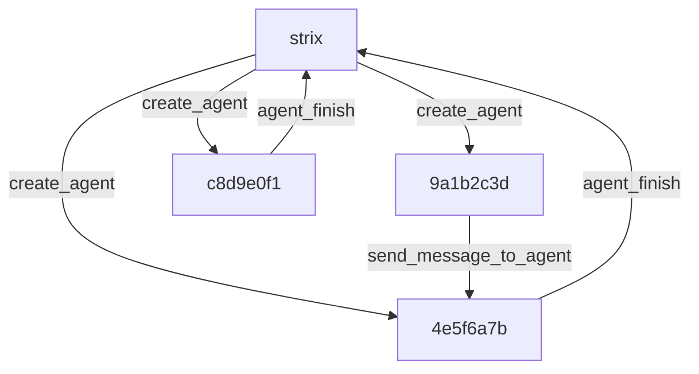

## Overview

Strix models a scan as a tree, not a vague graph of specialized agents. The root agent `strix` carries `parent=None` and does the reasoning and orchestration, while `AgentCoordinator` in `strix/core/agents.py` acts as the non-LLM control plane. Each child gets a short 8-hex id under that root, and the coordinator never becomes an agent itself.

The agent loop page, [The agent loop](./03-the-agent-loop.md), covers the lifecycle rules that keep this tree moving. The official docs already cover [Skills](https://docs.strix.ai/advanced/skills) and [scan modes](https://docs.strix.ai/usage/scan-modes).

The diagram below shows one root and three children. Spawn arrows point from parent to child, and message arrows point into another agent's inbox or back into the parent's inbox.

## The coordinator owns the tree

`AgentCoordinator` owns the tree as a control plane, not as an agent. `strix/core/agents.py` gives it parallel maps for `statuses`, `parent_of`, `names`, `metadata`, `pending_counts`, and `runtimes`, plus the lock, snapshot path, and shutdown flags that keep the scan consistent. `AgentRuntime` holds the live SDK `session`, the current asyncio `task`, the active `stream`, the `interrupt_on_message` flag, and the wake `Event`, so the coordinator can steer live work without inventing a second runtime model. That structure lets `view_agent_graph`, `wait_for_message`, and subtree cancellation read the same state from one place.

## Spawning

`run_strix_scan` in `strix/core/runner.py` creates the root agent as `name="strix"` with `parent_id=None`, then installs a `spawn_child_agent` closure in the run context. `create_agent` in `strix/tools/agents_graph/tools.py` calls that closure, which reaches `spawn_child_agent` in `strix/core/execution.py`; the helper assigns a short 8-hex id, registers the child, opens a child session, and starts a detached asyncio task. The parent keeps moving while the child runs in parallel, so branching adds capacity instead of blocking the current turn. The parent and child also keep separate sessions, which keeps parallel work easy to address later.

## Coordination through sessions, not a message bus

Strix does not route agent traffic through a separate bus. `coordinator.send` appends a formatted user-role item into the target agent's SDK session, increments `pending_counts`, wakes the agent, and interrupts the active stream when `interrupt_on_message` is set. The inbox is the session itself, so `wait_for_message` and `consume_pending` reuse the same delivery path that the SDK already understands instead of building a second queue. That keeps every message inside the same turn history, so a resumed child sees the inbox it already knows instead of a separate transport layer.

## Inheritance at spawn

`child_initial_input` in `strix/core/inputs.py` folds the parent's prior context into the child's first user message along with the new task and identity line. That gives the child the background it needs without making it continue the parent's work, and it keeps providers that insist on strict role alternation from rejecting the turn. The result is a child that starts informed, but still owns its own branch.

## Termination is tool-gated

`agent_finish` is the child exit path. It marks the child `completed`, sends a completion report into the parent's inbox, and lets the parent decide what to do next. `finish_scan` in `strix/tools/finish/tool.py` is the root-only exit path; it persists the final report, refuses to finish while any child remains active, and sets the root agent to `completed` when the scan closes cleanly. That gate keeps [The agent loop](./03-the-agent-loop.md) honest, and the lifecycle tools themselves live with the rest of the toolkit layer in [The toolkit layer](./05-the-toolkit-layer.md).

## Resume rebuilds the tree

`run_strix_scan` treats resume as an "as of" capability. It reloads the coordinator snapshot, then `respawn_subagents` in `strix/core/execution.py` reconstructs only the non-terminal descendants from that snapshot and restarts them with their saved names, tasks, and skills. Finished branches stay finished, live branches come back, and the tree resumes from the same ancestry map instead of starting over. The resumed tree also keeps completed nodes complete and waiting nodes waiting, instead of relaunching everything from scratch.

## The tree is load bearing

`view_agent_graph` walks `parent_of` to render the hierarchy, and `stop_agent` can cancel a subtree by walking descendants in leaves-first order. Those behaviors work only because the tree shape carries real control meaning, not because the code keeps a flat pool of interchangeable workers. That is why the parent links matter everywhere from messaging to shutdown.

## Where to look in the code

- `strix/core/runner.py` — creates the root agent `strix`, installs `spawn_child_agent`, and respawns non-terminal children on resume.
- `strix/core/agents.py` — holds `AgentCoordinator`, `AgentRuntime`, status maps, parent links, pending counts, wake events, snapshots, and shutdown state.
- `strix/core/execution.py` — starts detached child tasks, opens child sessions, and rebuilds children from persisted state with `respawn_subagents`.
- `strix/core/inputs.py` — builds `child_initial_input`, which carries inherited context into a child's first user message.
- `strix/tools/agents_graph/tools.py` — exposes `view_agent_graph`, `create_agent`, `send_message_to_agent`, `wait_for_message`, `agent_finish`, and `stop_agent`.
- `strix/tools/finish/tool.py` and `strix/agents/factory.py` — enforce root-only scan completion and attach the lifecycle tools to root and child `SandboxAgent`s.