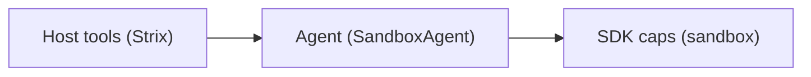

## Overview

The toolkit layer gives the model one interface and hides two tool families underneath it. Host-side function tools run in the Strix process and read the run context; SDK sandbox capabilities run inside the Docker sandbox and execute there. `build_strix_agent` in `strix/agents/factory.py` connects both sides, while the OpenAI Agents SDK owns tool discovery and schema exposure once the tools reach `SandboxAgent`.

The same split explains the rest of the runtime. Strix decides which tools each role gets, which skills load into the prompt, and which lifecycle tool ends a run. The SDK provides the actual tool transport and the sandbox capabilities that the model sees as ordinary tools.

Related concept pages: [the graph of agents](./02-the-graph-of-agents.md), [the agent loop](./03-the-agent-loop.md), [the docker sandbox](./04-the-docker-sandbox.md), [seeing traffic, proxy and browser](./06-seeing-traffic-proxy-and-browser.md).

## Host Side Function Tools

`strix/tools/thinking/`, `todo/`, `notes/`, `web_search/`, `reporting/`, `finish/`, `load_skill/`, `proxy/`, and `agents_graph/` all follow the same pattern: Strix decorates a callable with `@function_tool`, runs it in the Strix process, and passes in the `RunContextWrapper`. The tool reads `ctx.context`, pulls live state from the shared context dict, and returns JSON strings. That context bag carries the coordinator, agent ids, the sandbox session, the Caido client, `spawn_child_agent`, and the `interactive` flag.

`strix/tools/proxy/tools.py` shows the clearest example. Each proxy tool reads the live Caido client from context, serializes access with a lock, calls into `strix/tools/proxy/caido_api.py`, and returns JSON that the model can consume. The proxy family therefore stays host-side even though it controls a live security product.

`strix/tools/agents_graph/tools.py` uses the same pattern for agent coordination. The graph, spawn, message, wait, and stop tools all act on coordinator state from context rather than on sandbox files or shell commands. `finish_scan` and `agent_finish` complete the lifecycle story: the root agent ends with `finish_scan`, and child agents end with `agent_finish`.

`register_agent_tools` and `build_strix_agent(..., extra_tools=...)` show the extension pattern. Strix registers extra host-side tools once (rejecting any duplicate tool name) and appends them alongside the base tool set. The same shape appears in skill loading and runtime backend registration: Strix keeps the orchestration layer open for extension without asking the model to discover new mechanics.

## SDK Sandbox Capabilities

Strix does not write shell, filesystem, patching, or image viewing as function tools. `build_strix_agent` wires them in as SDK sandbox capabilities when it creates each `SandboxAgent`, and the SDK discovers them from the tool schema after attachment. That is why the directories that contain only README files — `strix/tools/shell/`, `strix/tools/agent_browser/`, `strix/tools/apply_patch/`, and `strix/tools/view_image/` — contain documentation rather than implementations.

The factory also preserves a naming bridge for `apply_patch`: the SDK exposes it to the model as `patch`, which matches the factory custom input-name mapping. `exec_command` and `write_stdin` make up the shell capability. They cover terminal work, process control, and interactive programs, including `python3`, because Strix does not ship a dedicated Python tool. The `tooling/python` skill makes that explicit, and the shell README explains that `write_stdin` only works for processes started with a PTY.

Browser automation sits in the same sandbox bucket. Strix does not add a separate browser function tool. Instead, the agent runs the `agent-browser` CLI through `exec_command` inside the container, and the always-loaded `tooling/agent_browser` skill gives the model the workflow rules. The browser page in the official docs covers usage; this page only places the capability in the architecture. The same applies to the proxy usage page: the official docs explain how to use it, while this page explains that the tool family itself lives on the host side.

## Assembly, Discovery, and Compatibility

`build_strix_agent` assembles each agent in one pass. It starts from `_BASE_TOOLS`, adds any registered extras, adds per-run extras, and then chooses the lifecycle tool by role. Root agents end with `finish_scan`; child agents end with `agent_finish`. The function also enforces unique tool names before it hands everything to `SandboxAgent`, which prevents ambiguous tool schemas.

Once the tools reach `SandboxAgent`, the SDK performs normal tool discovery from the attached schema. Strix does not run its own parallel discovery layer. It decides what to attach; the SDK decides how to present it to the model and how to execute it in the right environment.

A compatibility path keeps older chat completions models usable. When a backend cannot accept Responses-style custom tools, Strix rewrites those custom tools into function tools and wraps tool errors as model-visible results. That keeps the model-facing interface stable even when the backend expects a different tool shape.

## Reader Facing Anchors

- **Proxy** — host-side function tools that query Caido from the Strix process. The official usage page covers the commands; this layer explains why the tools stay host-side and adds the architectural view in [seeing traffic, proxy and browser](./06-seeing-traffic-proxy-and-browser.md): [`https://docs.strix.ai/tools/proxy`](https://docs.strix.ai/tools/proxy).
- **Browser** — `agent-browser` runs through shell inside the container, and the always-loaded `tooling/agent_browser` skill guides it. The official usage page covers the CLI; this layer explains why the browser is not a separate function tool and adds the architectural view in [seeing traffic, proxy and browser](./06-seeing-traffic-proxy-and-browser.md): [`https://docs.strix.ai/tools/browser`](https://docs.strix.ai/tools/browser).
- **Terminal** — the SDK shell capability exposes `exec_command` and `write_stdin`. It handles command execution and interactive sessions in the sandbox.
- **Python** — no dedicated Python tool exists. Agents run `python3` through the shell, which keeps Python inside the same sandbox and networking rules as every other command.

## Diagram

## Where to look in the code

- `strix/agents/factory.py` — assembles `_BASE_TOOLS`, extra tools, lifecycle tools, and sandbox capabilities into each `SandboxAgent`.
- `strix/agents/prompt.py` — loads always-on skills such as `tooling/agent_browser` and `tooling/python` into the prompt.
- `strix/tools/proxy/tools.py` and `strix/tools/proxy/caido_api.py` — define the host-side proxy tools and the live Caido client they read from context.
- `strix/tools/agents_graph/tools.py` — defines the agent tree, message passing, wait logic, and child completion flow.
- `strix/tools/finish/tool.py` and `strix/tools/load_skill/tool.py` — show the root finish path and the in-conversation skill loading path.
- `strix/tools/shell/README.md`, `strix/tools/agent_browser/README.md`, `strix/tools/apply_patch/README.md`, `strix/tools/view_image/README.md` — document SDK-provided capabilities rather than Strix implementations.